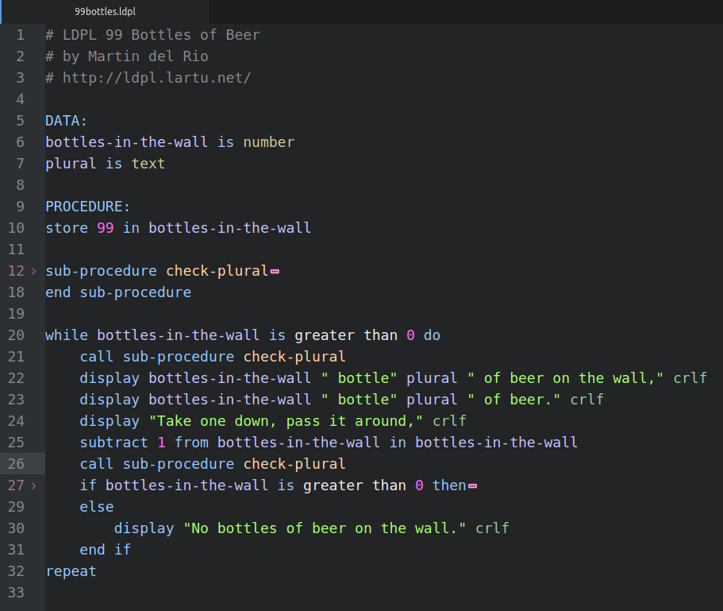

# language-ldpl

Adds syntax highlighting and code folding to [LDPL](https://www.ldpl-lang.org/) files in Atom.

This package uses the [tree-sitter-ldpl](https://www.npmjs.com/package/tree-sitter-ldpl) grammar.

## Example

Example code taken from Lartu/ldp.

Syntax theme: [Atom Dark](https://atom.io/themes/atom-dark-syntax)
